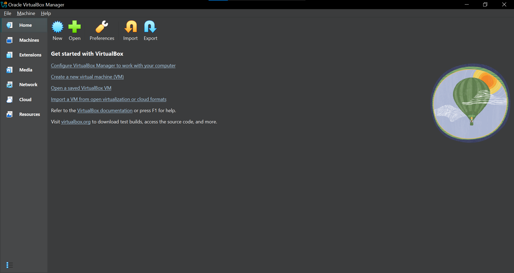
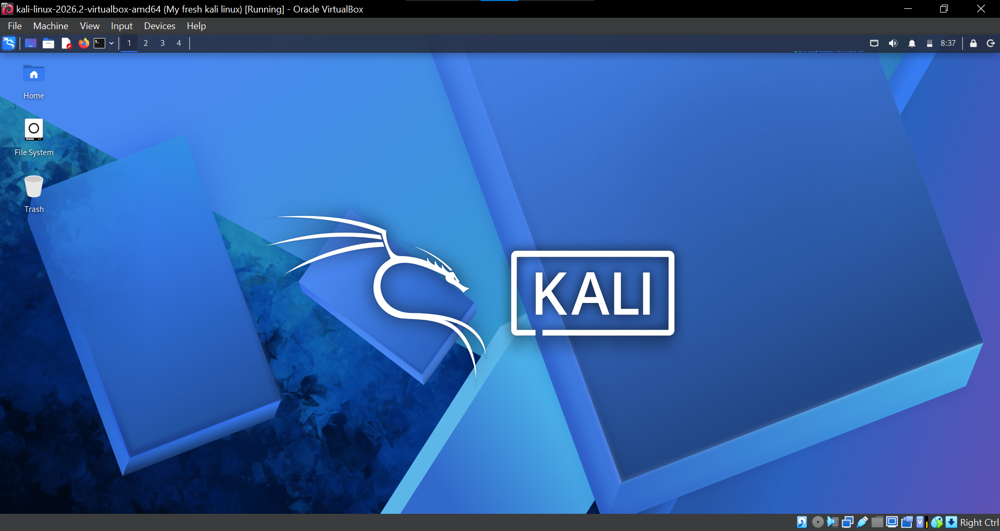
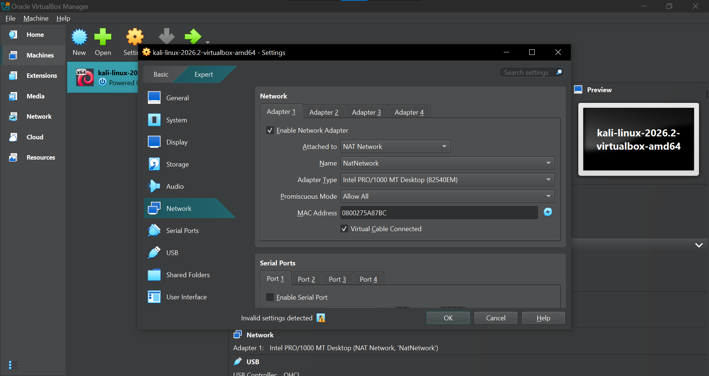
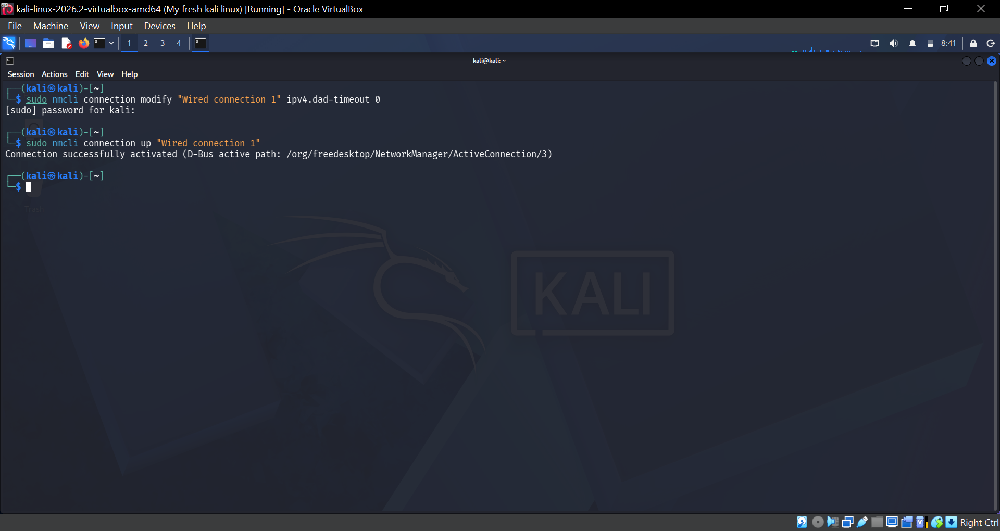
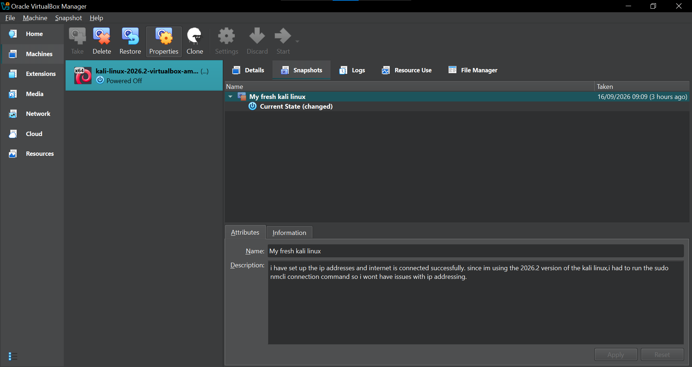

#My Cybersecurity Lab Setup Week1
..
## Overview 
This week's project, i setup my own virtual cybersecurity lab using Virtualbox and Kali Linux. This lab will be the base for future security practice and learning.

## purpose of the Lab
The purpose of this lab is to create an isolated,controlled environment where i can safely learn and practice cybersecurity skills such as network scanning, vulnerability testing and general Linux/security tool usage without putting my main computer or network at risk.
..

## What i set up
- Installed and configure **virtualBox** as my hypervisor
- Installed **Kali Linux** as my virtual machine
- configured a private **NAT** network so the VM can connect safely without touching my main network.
- Configure network connectivity for Kali Linux.
- Assign a consistent IP address to the Kali VM.
- Verify network connectivity and DNS resolution.
- Take a clean VM snapshot for recovery.

## My Setup Details
|Components      |  Configuration
|----------------|---------------
|Host OS         | Windows 10
|Hypervisor      | VirtualBox 7.2
|Guest OS        | Kali Linux 2026.2
|Network Type    | NAT Network
|Network Address | 10.0.0.0/24
|Kali IP Address |	10.0.0.2/24
| Default Gateway| 	10.0.0.1
| DNS Server     |	8.8.8.8


# 🪜 Lab Setup Procedure

## Step 1. Install 7-Zip

7-Zip was installed to extract the Kali Linux virtual-machine package, which may be distributed as a `.7z` archive.

**Tool:** 7-Zip

---

### Step 2. Install VirtualBox


This shows virtualBox installed and ready on my machine.

### step 3. Kali Linux Imported

This shows Kali Linux successfully imported and running as a VM.

The VM network adapter was configured as follows:

```text
Adapter 1
Attached to: NAT Network
Network:     NatNetwork
Adapter Type: Intel PRO/1000 MT Desktop
```


### 4. NAT Network Setup

This shows the NAT network i configured for the lab,giving the VM internet access while staying isolated from my main network.

### NAT Network Configuration

```text

Network Name:      NatNetwork

IPv4 Prefix:       10.0.0.0/24

DHCP:              Enabled

IPv6:              Disabled

```

### 4. Checking Network Connectivity

This shows me running `sudo nmcli connection` inside Kali Linux to verify the VM was connected to the network correctly.


---

### 5. Snapshot Taken

This shows a clean snapshot taken after setup was complete, so I can roll back to this working state if anything breaks later.

Example snapshot name:

```text
My fresh kali linux
```


The snapshot represents the clean baseline of the laboratory.

If a future exercise changes or damages the VM configuration, the machine can be restored to this baseline.


---

# 🔎 Lab Verification

| ✅ Test                        | 🧾 Command                      | 🎯 Expected Result              |
| ----------------------------- | ------------------------------- | ------------------------------- |
| 🌐 Check IP address           | `ip a`                          | Correct Kali IP displayed       |
| 📡 Test gateway               | `ping 10.0.0.1`                 | Successful replies              |
| 🌍 Test Internet connectivity | `ping 8.8.8.8`                  | Successful replies              |
| 🔎 Test DNS resolution        | `nslookup networkwalks.com`     | Domain resolves                 |
| 🧰 Verify Nmap                | `nmap --version`                | Nmap version displayed          |
| 🔄 Verify snapshot            | Restore snapshot and run `ip a` | Baseline configuration restored |

### Example Results

```text
IP Address:
10.0.0.2/24

Gateway:
10.0.0.1

DNS:
8.8.8.8
```

---

# 🐞 Problems Encountered & Solutions

Documenting problems is an important part of the project.

## Problem 1. Internet Connectivity After Static IP Configuration

After manually configuring the IPv4 settings, Internet connectivity may fail depending on the Kali/NetworkManager configuration.

One workaround used during this lab was:

```bash
sudo nmcli connection modify "Wired connection 1" ipv4.dad-timeout 0
```

The network connection was then restarted/rebooted and connectivity was tested again.

> **Important:** Network interface and connection names may differ between systems. Students should first identify their actual connection name before running an `nmcli` command.

---

## Problem 2. VirtualBox VT-x / Virtualization Error

The VM initially failed to start because hardware virtualization was disabled in the system firmware/BIOS.

The issue was resolved by:

1. Restarting the computer.
2. Entering BIOS/UEFI settings.
3. Enabling Intel VT-x / hardware virtualization.
4. Saving the configuration.
5. Restarting the computer.
6. Starting the Kali VM again.

After enabling virtualization, the VM started successfully.


---

# 💡 What I Learned

Through this project, I learned how to create and configure a virtual environment for cybersecurity practice.

The most important concepts I learned include:

### 1. NAT vs NAT Network

A standard NAT configuration and a NAT Network serve different purposes.

A NAT Network allows multiple VMs connected to the same virtual network to communicate with one another while providing network address translation for external connectivity.

This makes it useful for building a multi-machine cybersecurity laboratory.

### 2. Virtual Machine Networking

I learned how VirtualBox virtual network adapters connect virtual machines to different types of networks and how network configuration affects communication between machines.

### 3. Static IP Configuration

I learned how to configure and verify IPv4 addressing, subnet masks, gateways, and DNS settings in Kali Linux.

### 4. VM Snapshots

I learned that a clean snapshot should be created **before performing risky or experimental activities**.

This provides a known-good recovery point for future cybersecurity exercises.

### 5. Documentation

I learned that documenting commands, configuration, screenshots, problems, and solutions is an important part of a professional cybersecurity project.

---

#  Security & Ethical Use

This laboratory is intended strictly for education purposes only.

---

# 🔗 Tools & Resources

- **7-Zip:** [https://7-zip.org/download.html](https://7-zip.org/download.html)
- **VirtualBox:** [https://virtualbox.org/wiki/Downloads](https://virtualbox.org/wiki/Downloads)
- **Kali Linux:** [https://kali.org/get-kali](https://kali.org/get-kali)

---

# 👤 Author

**Chesangha Quinneta**

**Networkwalks 2026 Intern**


LinkedIn:[https://www.linkedin.com/in/cyber~-nneta-77a37b3ab?utm_source=share_via&utm_content=profile&utm_medium=member_ios

---

##  Project Information

**Program Name:** Cybersecurity at Networkwalks | **Week:** 01 | **Project:** Cybersecurity & Pentesting Lab Setup | **Repository:** GitHub
